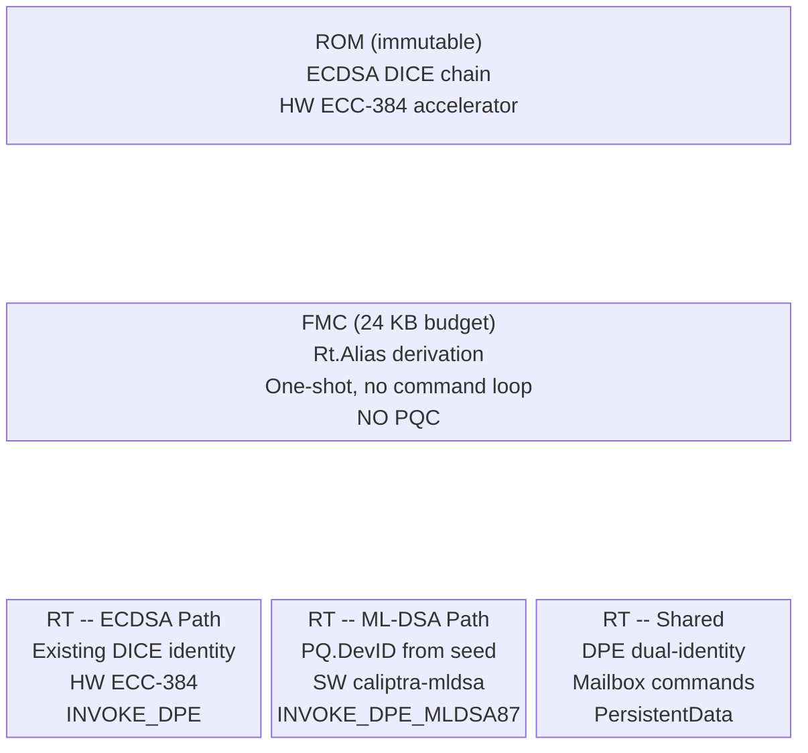
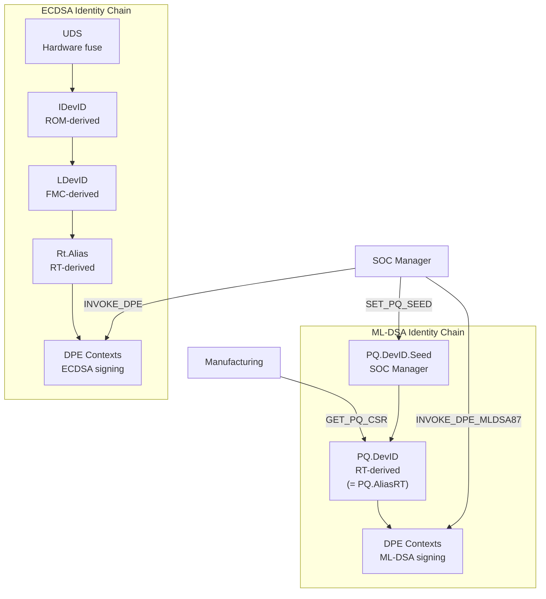
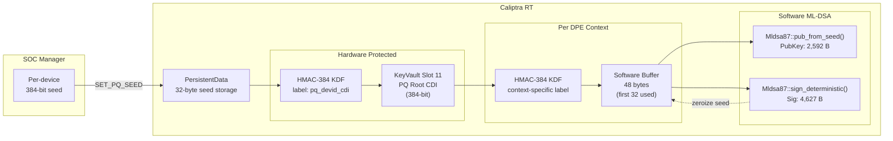
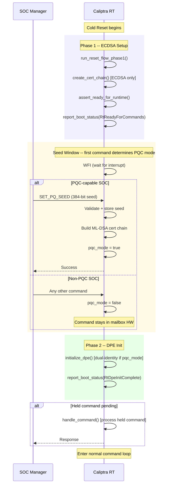
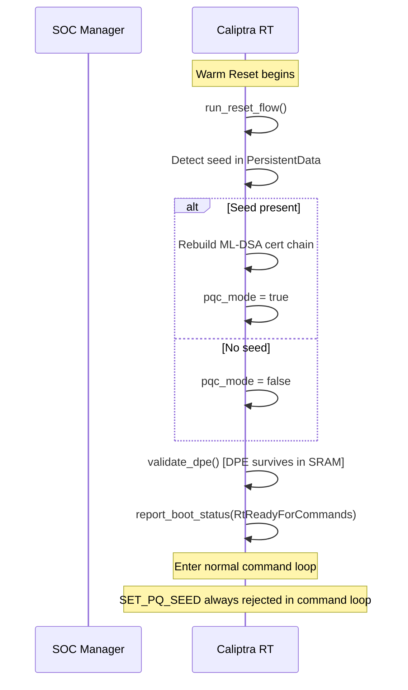
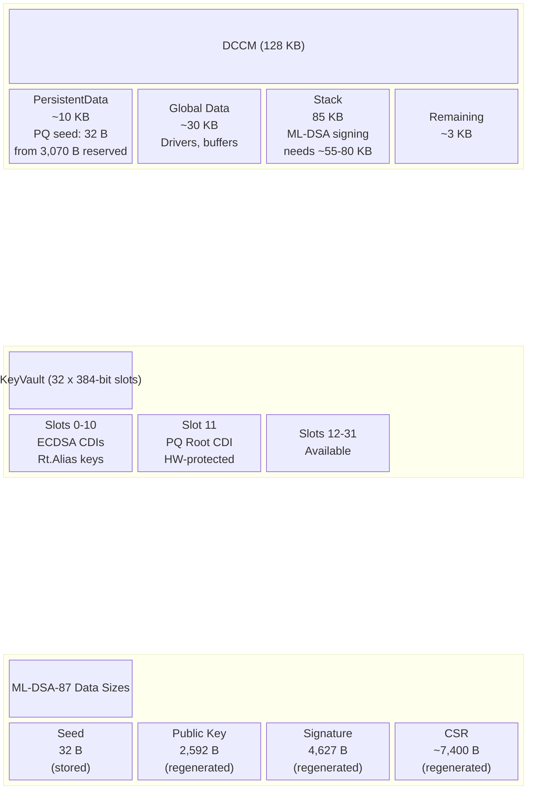
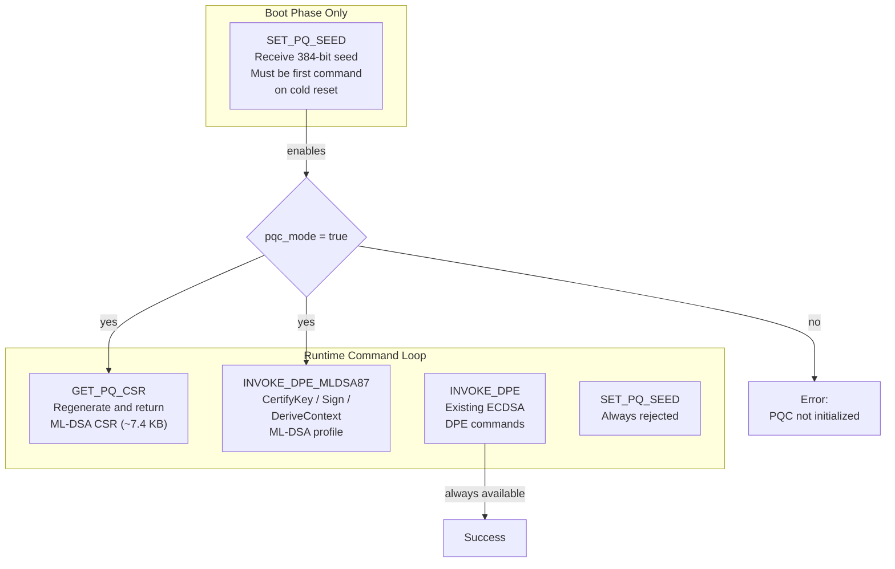
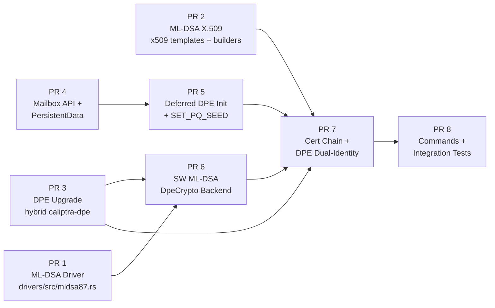

# PQC ML-DSA Identity Retrofit -- Architecture Summary

## Executive Summary

Caliptra 1.x ships with ECDSA-only device identity. As post-quantum cryptography mandates approach (2027-2028), the installed base risks deprecation. This retrofit adds a parallel ML-DSA-87 identity chain through a firmware-only update to Runtime (RT), requiring no hardware or ROM changes. A SOC Manager-provided seed drives deterministic ML-DSA key generation and signing in software, integrated with DPE for dual-identity attestation.

---

## Where PQC Lives in the Firmware Stack

PQC is confined entirely to RT. ROM and FMC are untouched.

**Why RT-only**: FMC is a one-shot boot stage with a 24 KB code budget and no command loop. ML-DSA software requires significant code space and stack. RT has 96 KB code budget, 85 KB stack, and a persistent command loop.

---

## Dual Identity Architecture

Two independent identity chains coexist. The ECDSA chain is unchanged. The ML-DSA chain is additive.

**Key simplification**: Since firmware measurements are excluded from PQC identity (to avoid costly re-provisioning on firmware updates), PQ.DevID and PQ.AliasRT are the same identity. There is no separate FMC-layer PQC certificate.

---

## Key Design Decisions

| Decision | Choice | Rationale |
|----------|--------|-----------|
| PQC firmware stage | RT only | FMC has no command loop and only 24 KB code budget |
| Seed source | SOC Manager (external) | Avoids awkward internal derivation from ECDSA keypair hash |
| FW measurement in PQC identity | Excluded | Re-provisioning ML-DSA cert on every FW update is operationally unacceptable |
| Persistent storage | Seed only (32 B) | PersistentData has only 3 KB reserved; pubkey (2.6 KB) + sig (4.6 KB) would not fit |
| Artifact regeneration | On-demand deterministic | ML-DSA keygen/signing are deterministic; trade compute for memory |
| DPE integration | Dual-identity (separate commands) | Follows caliptra-dpe `hybrid` feature pattern from main branch |
| DPE init timing | Deferred until after first command | Allows seed reception without changing ROM/SOC Manager protocol |
| PQ CDI storage | KeyVault slot 11 | Hardware-protected; never leaves KeyVault; mirrors ECDSA CDI pattern |

---

## Key Derivation Flow

**Contrast with ECDSA**: The ECDSA path uses hardware ECC-384 throughout -- private keys never leave the KeyVault. The ML-DSA path must extract a derived seed to software because `caliptra-mldsa` is a pure software implementation. Seeds are zeroized immediately after use.

---

## Cold Reset Boot Flow

**Why deferred DPE init**: DPE initialization is lightweight (~milliseconds, mostly data structure setup, no crypto). Deferring it until after the first command allows `SET_PQ_SEED` to arrive before DPE needs to know about PQC mode, without requiring any changes to ROM or the existing SOC Manager protocol (ROM expects `RtReadyForCommands` before sending any commands).

**Held command handling**: When the first command is not `SET_PQ_SEED`, the mailbox hardware naturally holds it. The command ID register is a non-destructive read, and the payload stays in mailbox SRAM until explicitly consumed. No software buffering is needed.

---

## Warm Reset Flow

**Key difference from cold reset**: No seed window. The seed persists in PersistentData (DCCM SRAM, inside Caliptra trust boundary). PQC mode is determined automatically. DPE is validated, not re-initialized.

---

## Memory Architecture

**Stack is the critical constraint**: ML-DSA signing requires ~55-80 KB of stack (PrivateKey 23.7 KB expanded + Signature 15.4 KB + polynomial temporaries). The 85 KB stack leaves very little headroom. The ML-DSA driver uses `#[inline(never)]` to prevent keygen and signing frames from coexisting on the stack.

---

## Command Interface

**Gating**: `GET_PQ_CSR` and `INVOKE_DPE_MLDSA87` require `pqc_mode == true`. Existing ECDSA commands are always available regardless of PQC mode. `SET_PQ_SEED` is only accepted as the very first command on cold reset.

---

## Implementation Roadmap

| PR | Scope | Key Risk |
|----|-------|----------|
| 1 | `caliptra-mldsa` driver wrapper, KAT tests | None (isolated) |
| 2 | Generic `CertBuilder`, ML-DSA CSR template | ECDSA regression from refactor |
| 3 | External DPE upgrade with `hybrid` feature | Largest API surface change |
| 4 | Command IDs, request/response types, PersistentData | Layout compatibility |
| 5 | Boot flow restructure, seed window | Most architecturally complex |
| 6 | DPE crypto backend for ML-DSA | Stack depth for signing |
| 7 | PQ.DevID cert chain, dual-identity DPE init | Integration of all prior PRs |
| 8 | Final command handlers, full test suite | End-to-end correctness |

---

## Open Risks

| Risk | Severity | Mitigation |
|------|----------|------------|
| **Stack depth**: ML-DSA signing needs ~55-80 KB against 85 KB stack | High | `#[inline(never)]` on driver methods; may need to refactor `sign_internal` to split loop body into sub-functions |
| **Code size**: `caliptra-mldsa` adds polynomial arithmetic to RT's 96 KB budget | Medium | Measure at PR 1; `opt-level = "s"` + LTO already enabled; feature-gated so disabled builds are unaffected |
| **Performance**: Software ML-DSA on RISC-V for CSR regeneration on every `GET_PQ_CSR` call | Low | Acceptable for manufacturing flow; can cache CSR later if needed |
